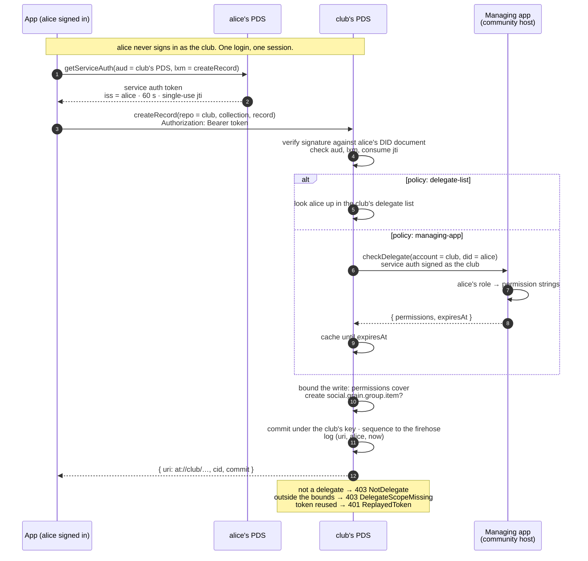
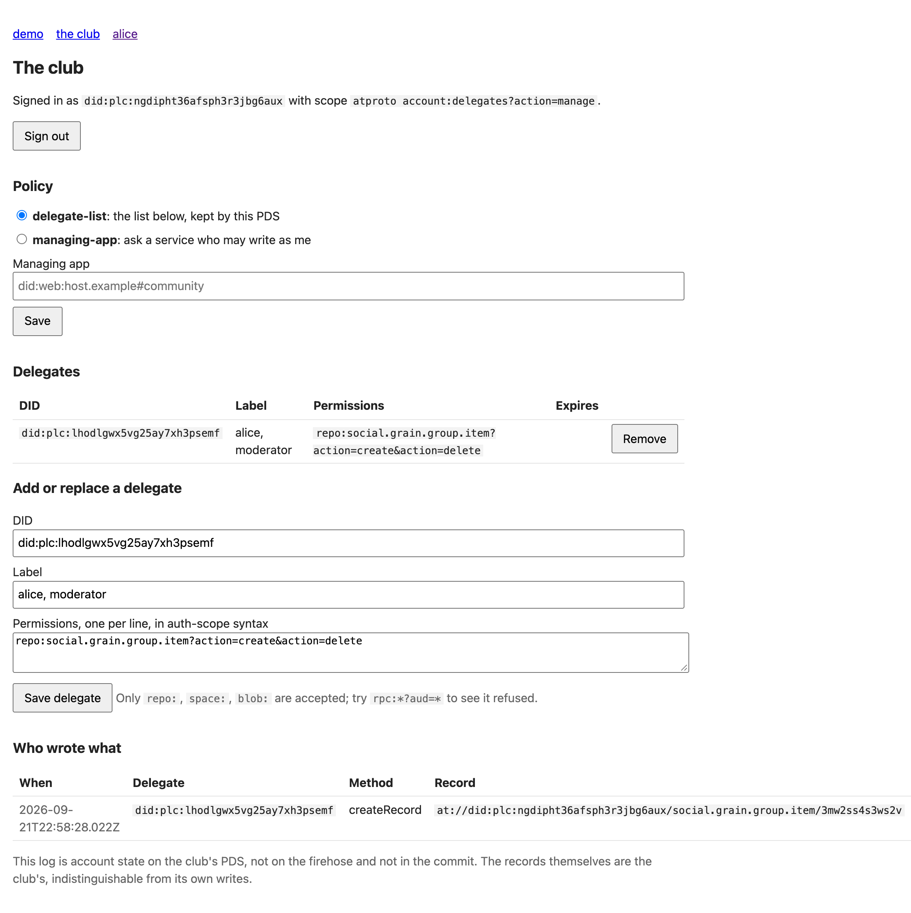

# Account delegates: a runnable prototype

A working model of [proposal 0017, Account Delegates](./docs/0017-account-delegates.md): writing to an atproto account you do not sign in to, bounded by that account, attributed to you, with no shared secret and no change to OAuth.

The problem it answers: a community, a brand, or any shared identity is one DID, and several people need to write to it. Today that means a shared password or app passwords passed around. The prototype shows the alternative the proposal describes. The account names its **delegates** and what each may do. A delegate authenticates **as themselves**, with a service auth token from their own PDS, names the account as `repo`, and the account's PDS commits the write under the account's key and remembers who asked.

## The flow



## Run it

You need Node 22.13 or newer and pnpm. Nothing else: the atproto spaces alpha comes from npm.

```sh
pnpm install
pnpm demo
```

The demo brings up a PLC directory, two PDSes with account delegates, and a managing app, all in one process on ports 2700 to 2703 (override with `PLC_PORT`, `PDS_A_PORT`, `PDS_B_PORT`, `HOST_PORT`). Then it walks the flow and checks each outcome against the proposal:

1. A club account on one PDS, two people on the other.
2. Nobody is a delegate: a write as the club is refused with `NotDelegate`.
3. The club, with its own session, makes alice a delegate for one collection. An `rpc:` permission is refused. alice cannot manage the club's delegates.
4. alice writes as the club from her own PDS. The record lands under the club's DID, anyone can read it, the club's latest commit is that write, and the club's log names alice.
5. Bounds: a collection outside her permissions, a non-delegate, a replayed token, a token bound to the wrong method, and a batch with one uncovered write. Every one refused, nothing written.
6. `removeDelegate` takes effect on the next write.
7. The club switches to the `managing-app` policy. The host answers from roles only it holds, signed as the club, and the PDS caches the answer.
8. The host ejects alice. She succeeds inside the cache TTL and is refused after it.
9. The club's own writes are untouched; its session goes straight to the stock PDS.

It ends with `All checks passed.` and a non-zero exit if anything did not.

## In a browser

The same network, plus a small app, so the flow can be watched instead of read:

```sh
pnpm demo:app
```

Open `http://127.0.0.1:2704`. Two doors. **The club** is the controller's tool: it signs in as the club through the PDS's own OAuth consent screen, asking for one permission, `account:delegates`, and then sets the policy, names delegates, and reads the write log. **alice** is a delegate's app: she signs in as herself at her own PDS, picks "Acting as Peninsula Riders", and presses a button. Every write is signed as alice and addressed to the club's PDS with `repo` set to the club. The app holds no key and no credential for any account. Passwords are `club-pass` and `alice-pass`.

| | |
|---|---|
|  |  |
| The club's consent screen. The **Delegates** card is the `account:delegates` permission the proposal adds. | alice's consent screen with the `com.atproto.repo.delegatedWrites` permission set: one line, from the set's own title. The raw `rpc:` scope renders as "Authenticate: perform actions on your behalf" instead ([screenshot](docs/screenshots/06-consent-raw-scope.png)); same grant, different legibility. |
|  |  |
| alice, acting as the club: the gallery is accepted under the club's DID, the post is refused as outside her bounds. | The club: policy, the delegate list, and who wrote what. |

Nothing on alice's consent screen names the club. What she consents to is that this app may write, as her, to accounts that name her; whether the club names her is the club's decision, on the club's PDS. Discovery, how the app learns which accounts those are, is the proposal's open question, and the page takes its third option: after sign-in the app asks the community host it knows for accounts where alice holds a role, and adds what it was configured with, each entry saying where it came from. A host can only answer for its own communities, which is the limit the proposal names. A role listed there states what the host intends; the write is still what decides.

Two ways to check it without clicking:

```sh
pnpm demo:app            # in one terminal
pnpm demo:walk           # the browser flow, headless: signs in and consents through the PDS's own consent-page API
node scripts/screenshots.mjs   # the same, in headless Chrome, saving docs/screenshots/
```

The consent screens are the stock provider UI with one patch, applied at install: `scripts/patch-account-delegates.mjs` adds `delegates` to the account attributes the scope parser accepts, and one card to the consent screen's account section. Without it the provider silently drops `account:delegates` from a request rather than refusing it. The chunk it edits is served as immutable, so a browser that has seen the unpatched one needs a hard refresh.

Two things the alpha's permission sets impose on the proposal's example, found by running it: an `include:` scope may name a specific service as `aud` but never `*`, so a set for general-purpose clients has to carry `aud=*` itself; and a set may only include methods under its own NSID authority, so the `com.atproto.space.*` methods need a sibling set. The RFC's example is corrected accordingly.

## What is in here

| Path | What it is |
|---|---|
| `src/delegates/router.ts` | The proposal's substance: the delegated write path (authenticate the delegate's service auth, resolve the delegate under the account's policy, bound the write with the same permission matcher OAuth uses, commit as the account, log it) and the management methods. Each block names where it would live in the PDS. |
| `src/delegates/store.ts` | The account's delegate configuration and write log, as host state in SQLite. |
| `src/pds.ts` | A stock alpha PDS embedded as a library with the delegate router mounted in front. No package is modified beyond the one-attribute patch above; requests the router does not claim fall through. |
| `src/managing-app.ts` | What a community host becomes: roles, one `checkDelegate` answer, and a `listMemberships` query for the browser demo's discovery. It holds no keys and no credential for any account. |
| `src/demo.ts` | The transcript above. |
| `src/app.ts` | The browser demo's app: the club's settings tool and alice's app, server-rendered, signing in through OAuth with loopback clients. |
| `src/demo-app.ts` | Brings up the network for the browser demo, publishes the permission set on a local account, and waits. |
| `scripts/walk.mjs` | The browser flow, headless, as a check. |
| `scripts/screenshots.mjs` | The browser flow in headless Chrome, producing `docs/screenshots/`. |
| `scripts/patch-account-delegates.mjs` | Teaches the installed scope parser and consent screen about `account:delegates`. |
| `lexicons/` | Lexicon sketches for the new methods, and the `com.atproto.repo.delegatedWrites` permission set. |
| `docs/0017-account-delegates.md` | The proposal, copied here so the repo stands alone. |

## What it proves, and what it does not

**Proved, against unmodified published packages:** a delegate writes to an account on another PDS with nothing but their own session; the write is committed and signed by the account's PDS as the account; a delegate entry expressed as `repo:` permission strings is enforced by the alpha's own `ScopePermissions` matcher; `applyWrites` is all-or-nothing; tokens are method-bound, sixty-second, and single-use; the account can list who wrote what; both policies work, with a `managing-app` consulted over real HTTP with a token the PDS signs as the account and the app verifies against the account's DID document. In the browser demo, the same delegated write is made from an OAuth session gated by the `rpc:` permission the proposal describes, obtained through the stock consent screen, and the management methods are gated by `account:delegates`; the permission set resolves and renders as one line.

**Not built here, on purpose:**

- The delegate router is an extension mounted in front of the PDS, not a patch to it. The proposal's reference-implementation notes say where each piece goes; this is the same logic one process boundary out, so that a clone runs from npm.
- `pnpm demo` uses password sessions and `getServiceAuth`; the OAuth side is exercised by the browser demo only. Nothing in the delegated path depends on how the token was minted.
- The account portal's own settings pages. The club's tool is a separate small app, which is what the proposal expects of a brand's staff tooling; a PDS that adopted the proposal would put the same controls next to app passwords.
- Space writes, `uploadBlob`, `getDelegationToken`, and the `simplespace` management methods are on the proposal's surface and not on the router's. They follow the `repo` pattern exactly.
- Rate limiting by both account and delegate.
- `putRecord` is served, but not shown in the demo.

## Why this shape

The usual way to let several people act as one account is to let them sign in *as* it: the account's OAuth authorization server authenticates the person, looks up their standing, and issues a narrowed session. That works, but it puts the policy inside the authorization server, so the account has to live on a PDS that has been taught it, and every app carries a second session and a nested login. This prototype puts the policy on the account instead, where any PDS can read it, and reduces the service that knows about roles to an ordinary managing app that answers one question.
