# Account delegates: a runnable prototype

A working model of [proposal 0017, Account Delegates](./docs/0017-account-delegates.md): letting other people write to an atproto account, bounded by that account, attributed to them, with no shared secret and no change to OAuth.

The problem it answers: a community, a brand, or any shared identity is one DID, and several people need to write to it. Today that means a shared password or app passwords passed around. The prototype shows the alternative the proposal describes. The account names its **delegates** and what each may do; that configuration lives on the account's own PDS, whatever PDS that is. A delegate then exercises it one of two ways:

- **A delegated write.** The delegate's own app, with the delegate's own session, names the account as `repo` and signs the call with a service auth token from their own PDS. The account's PDS commits the write under the account's key and remembers who asked. One login, one session, no client has to know the account exists.
- **Sign-in as the account.** Any client, including one that has never heard of delegates, signs in with the account's identifier. The account's PDS authenticates the person at *their* PDS (a nested OAuth login asking for `atproto` only), checks that they are a delegate, and finishes the stock consent flow. The token is the account's, its scope cut down to the delegate's permissions, with `act.sub` naming the person. Every write with it is logged to them; removing the delegate ends the session on its next request.

Same delegate configuration, same bounds, same log. The first path is the proposal's primitive; the second is what makes it usable from every existing client today, and is the shape Tranquil PDS already runs for its delegated accounts.

A community account can also be **created from an app**, with no password anyone knows. The founder's app asks the founder's own PDS for a service auth token and calls `createDelegatedAccount` on the PDS the community should live on. That PDS mints the DID and repo and records the founder as a **controller**: someone who may manage the account's delegates, either from their own session by service auth, or by signing in as the account, where the narrowing keeps `account:delegates` for a controller and for nobody else. The app that created the community holds nothing for it.

## The flows

A delegated write, from the delegate's own session:

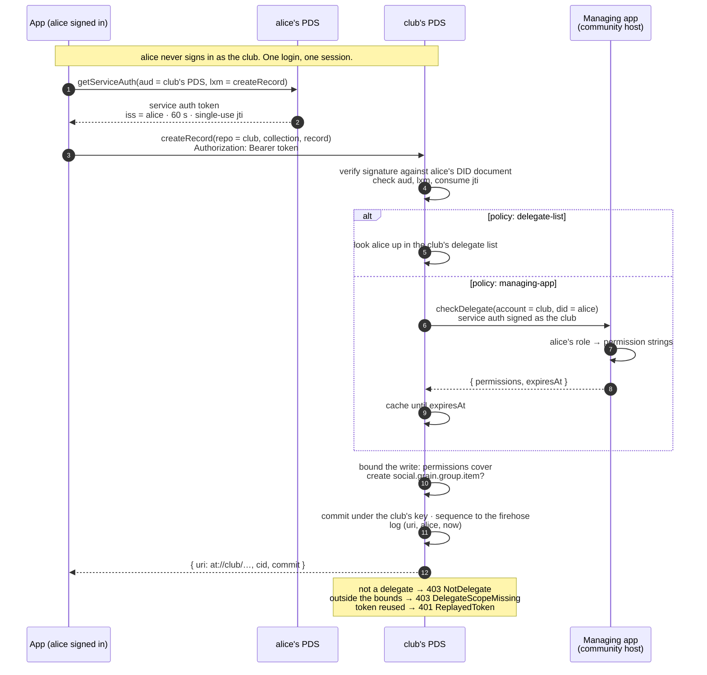
```mermaid
sequenceDiagram
  autonumber
  participant App as App (alice signed in)
  participant APDS as alice's PDS
  participant CPDS as club's PDS
  participant Host as Managing app<br/>(community host)
  Note over App,CPDS: alice never signs in as the club. One login, one session.
  App->>APDS: getServiceAuth(aud = club's PDS, lxm = createRecord)
  APDS-->>App: service auth token<br/>iss = alice · 60 s · single-use jti
  App->>CPDS: createRecord(repo = club, collection, record)<br/>Authorization: Bearer token
  CPDS->>CPDS: verify signature against alice's DID document<br/>check aud, lxm, consume jti
  alt policy: delegate-list
    CPDS->>CPDS: look alice up in the club's delegate list
  else policy: managing-app
    CPDS->>Host: checkDelegate(account = club, did = alice)<br/>service auth signed as the club
    Host->>Host: alice's role → permission strings
    Host-->>CPDS: { permissions, expiresAt }
    CPDS->>CPDS: cache until expiresAt
  end
  CPDS->>CPDS: bound the write: permissions cover<br/>create social.grain.group.item?
  CPDS->>CPDS: commit under the club's key · sequence to the firehose<br/>log (uri, alice, now)
  CPDS-->>App: { uri: at://club/…, cid, commit }
  Note over CPDS: not a delegate → 403 NotDelegate<br/>outside the bounds → 403 DelegateScopeMissing<br/>token reused → 401 ReplayedToken
```

Sign-in as the account, from a stock client:

```mermaid
sequenceDiagram
  autonumber
  participant Client as Stock client
  participant CPDS as club's PDS (authorization server)
  participant APDS as alice's PDS
  Client->>CPDS: OAuth authorize, login_hint = club.test,<br/>scope = what the client always asks for
  CPDS-->>Client: sign-in screen, with "sign in as a delegate"
  Note over CPDS: alice types her own handle
  CPDS->>APDS: nested OAuth login, scope = atproto only
  APDS-->>CPDS: alice authenticated (code → token, then discarded)
  CPDS->>CPDS: is alice a delegate of the club? (list or managing app)<br/>bind this request to alice; offer club.test as signed in
  CPDS-->>Client: the club's own consent screen, the client's scopes
  Note over CPDS: consent → scope ∩ alice's permissions; act.sub = alice
  CPDS-->>Client: access token for the club, narrowed, act.sub = alice
  Client->>CPDS: createRecord(repo = club, …) with that token
  CPDS->>CPDS: re-narrow to alice's current permissions · bound · commit as the club<br/>log (uri, alice, via session)
  Client->>CPDS: getSession
  CPDS-->>Client: { did: club, handle: club.test, act: { sub: alice } }
```

## Run it

You need Node 22.13 or newer and pnpm. Nothing else: the atproto spaces alpha comes from npm.

```sh
pnpm install
pnpm demo
```

The demo brings up a PLC directory, two PDSes with account delegates, and a managing app, all in one process on ports 2700 to 2703 (override with `PLC_PORT`, `PDS_A_PORT`, `PDS_B_PORT`, `HOST_PORT`). Then it walks the delegated-write path and checks each outcome against the proposal:

1. A club account on one PDS, two people on the other.
2. Nobody is a delegate: a write as the club is refused with `NotDelegate`.
3. The club, with its own session, makes alice a delegate for one collection. An `rpc:` permission is refused. alice cannot manage the club's delegates.
4. alice writes as the club from her own PDS. The record lands under the club's DID, anyone can read it, the club's latest commit is that write, and the club's log names alice.
5. Bounds: a collection outside her permissions, a non-delegate, a replayed token, a token bound to the wrong method, and a batch with one uncovered write. Every one refused, nothing written.
6. `removeDelegate` takes effect on the next write.
7. The club switches to the `managing-app` policy. The host answers from roles only it holds, signed as the club, and the PDS caches the answer.
8. The host ejects alice. She succeeds inside the cache TTL and is refused after it.
9. The club's own writes are untouched; its session goes straight to the stock PDS.
10. alice creates `riders.test` on pds-a from her own PDS, with service auth. The DID resolves, the account has no usable password, she writes as it, bob cannot. As a controller she adds bob by service auth from her own session; bob, a delegate but not a controller, cannot manage; she makes him a controller and he removes her as a delegate. Clearing every controller of riders is refused, while the club, which has a password, may have none. A taken handle, a caller not among the controllers, and an access token instead of service auth are each refused.

It ends with `All checks passed.` and a non-zero exit if anything did not.

## In a browser

The same network, plus a small app, so both paths can be watched instead of read:

```sh
pnpm demo:app
```

Open `http://127.0.0.1:2704`. Three doors. **The club** is the controller's tool: it signs in as the club through the PDS's own OAuth consent screen, asking for one permission, `account:delegates`, and then sets the policy, names delegates, and reads the write log and the delegated sessions. **alice** is a delegate's app: she signs in as herself at her own PDS, picks "Acting as Peninsula Riders", and presses a button; every write is signed as alice and addressed to the club's PDS with `repo` set to the club. **A stock client** has never heard of delegates: type `club.test`, choose *sign in as a delegate*, authenticate as alice at her own PDS, consent on the club's PDS, and the client holds the club's session. The app holds no key and no credential for any account. Passwords are `club-pass` and `alice-pass`.

| | |
|---|---|
| 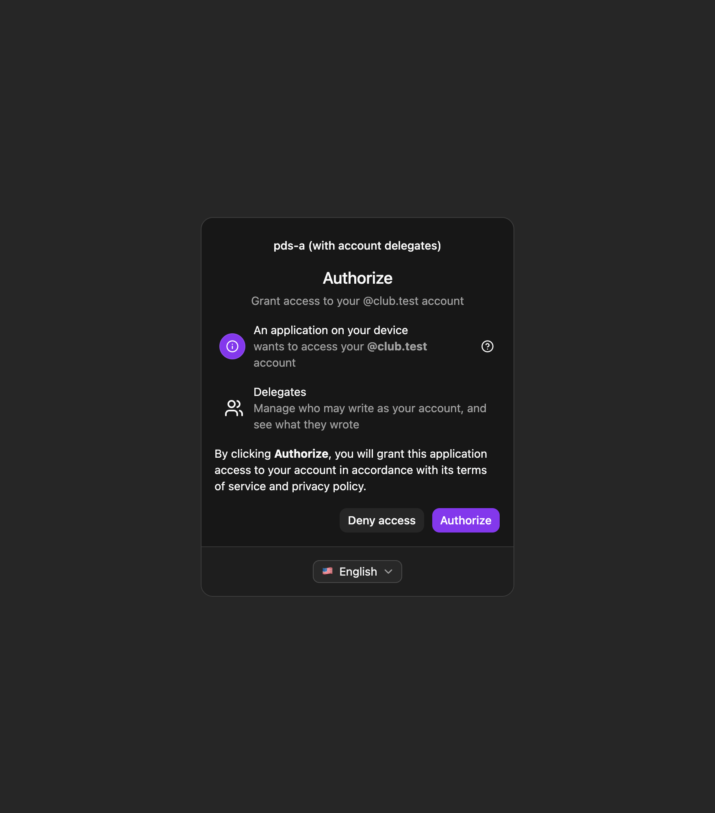 | 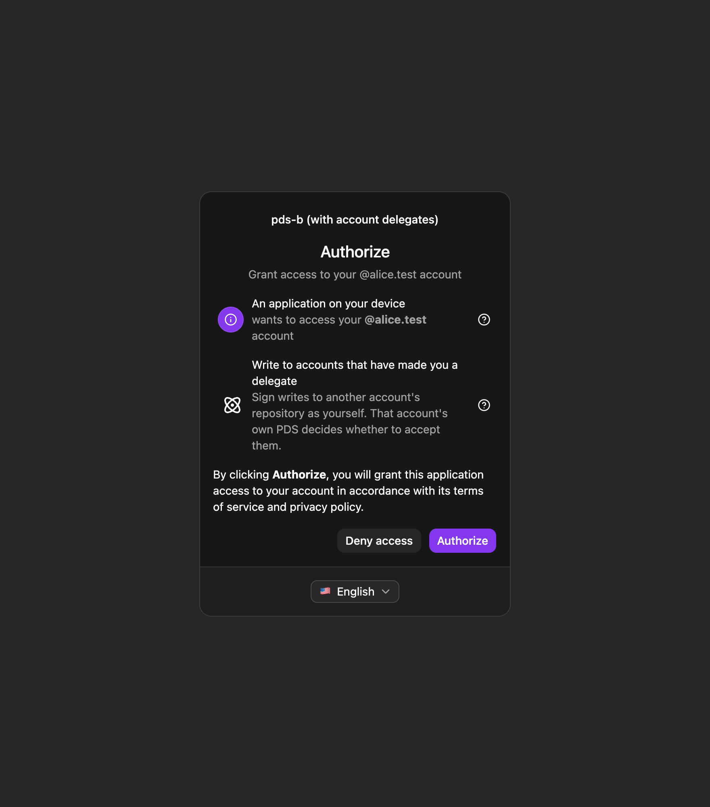 |
| The club's consent screen. The **Delegates** card is the `account:delegates` permission the proposal adds. | alice as a general-purpose app: the `com.atproto.repo.delegatedWrites` permission set, one line, whose title says the audience is open. An app for one host asks for an `rpc:` permission naming that PDS instead, which renders generically ([screenshot](docs/screenshots/06-consent-raw-scope.png)). |
| 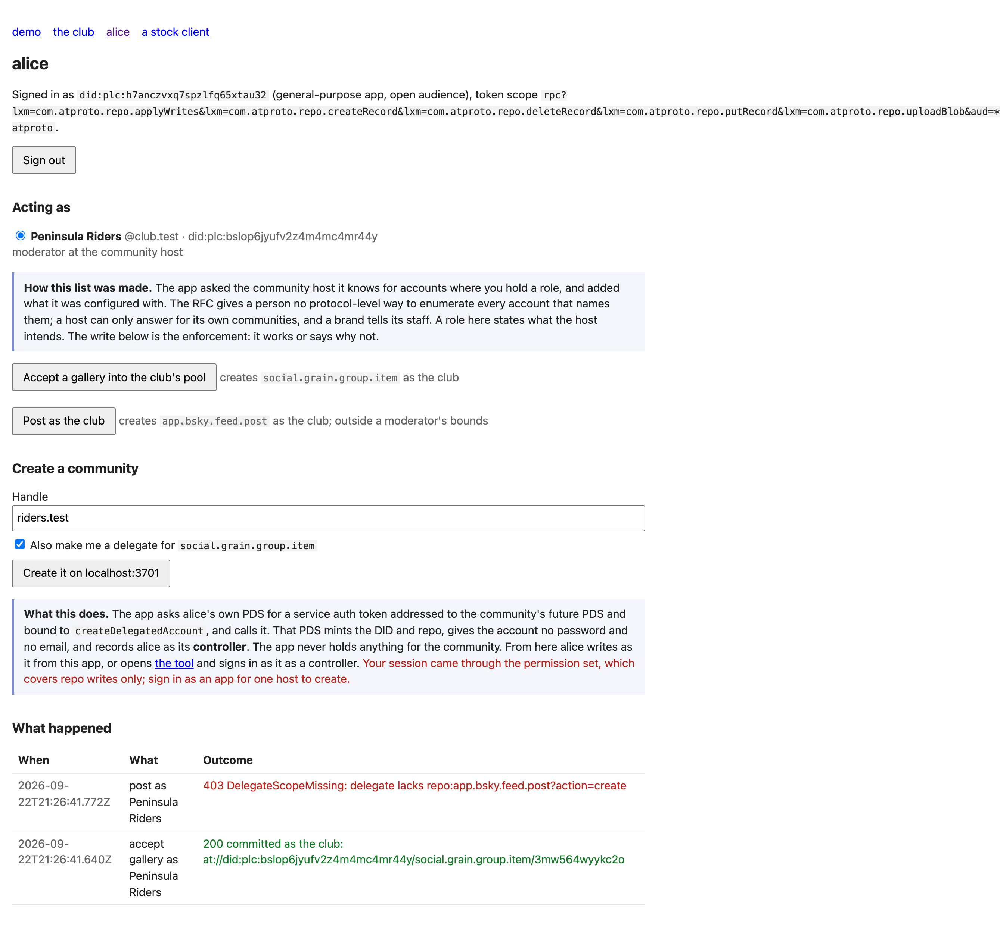 | 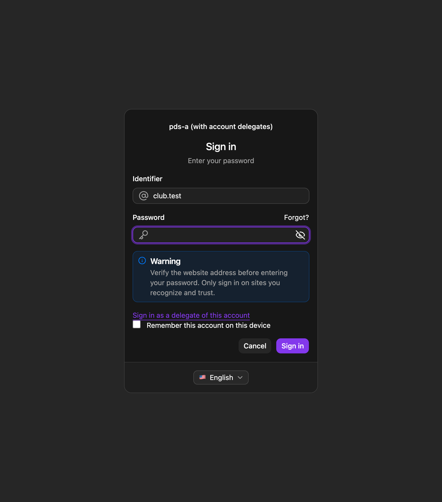 |
| alice, acting as the club from her own app: the gallery is accepted under the club's DID, the post is refused as outside her bounds. | The club's PDS's stock sign-in screen, reached by a client that only knows the authorize URL, with the one link this prototype adds. |
| 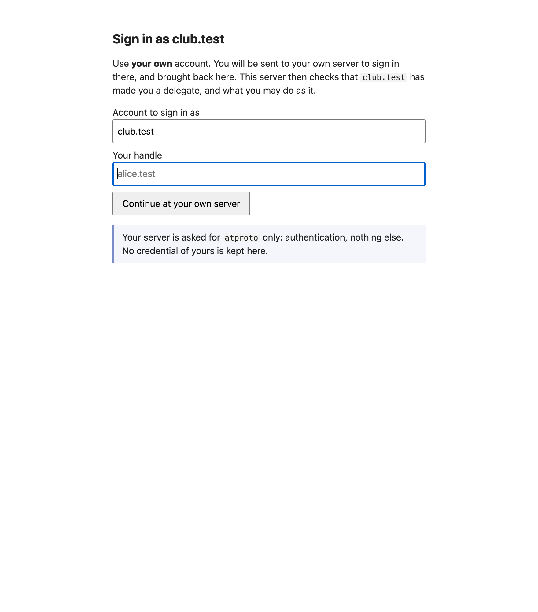 | 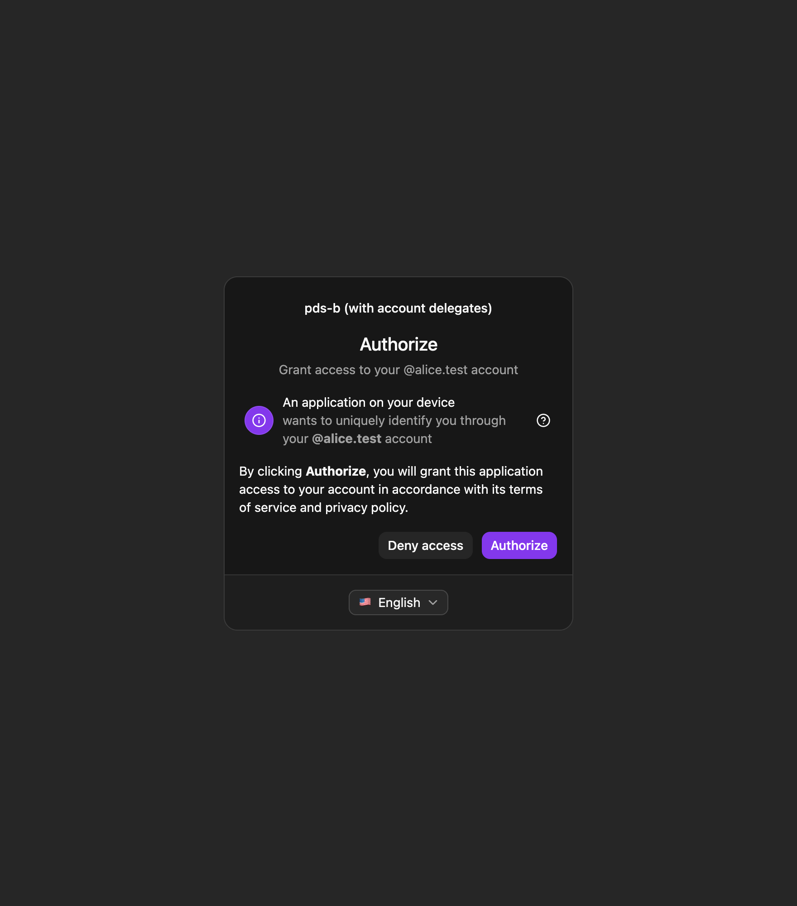 |
| The club's PDS asks for the person's own handle. | alice's own PDS: the club's PDS, as a client, asks for `atproto` only. Authentication, nothing else. |
| 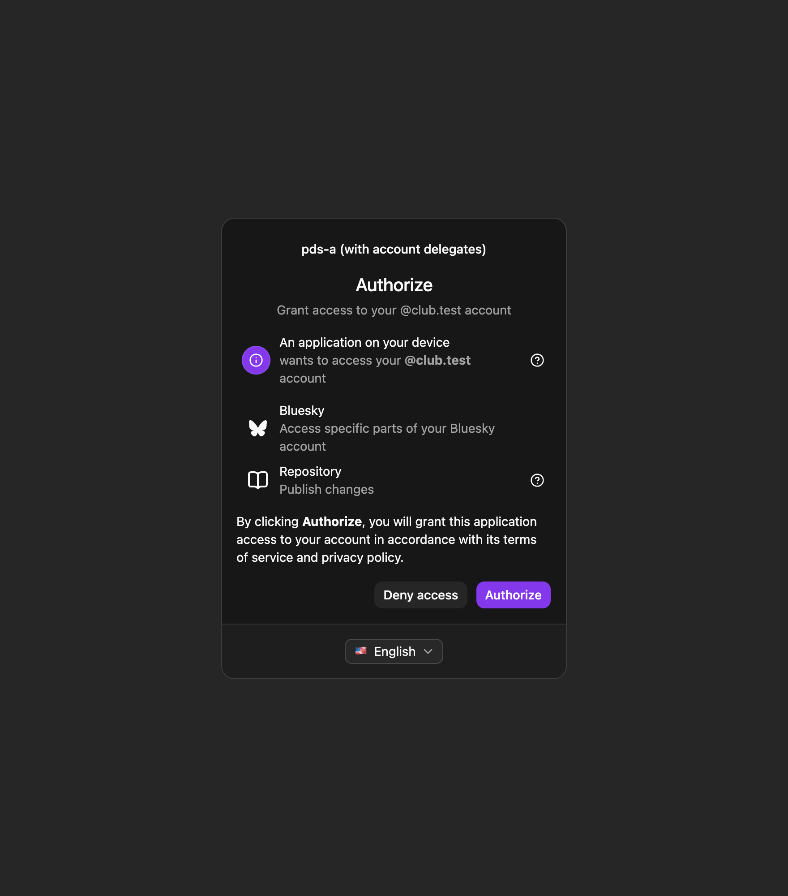 | 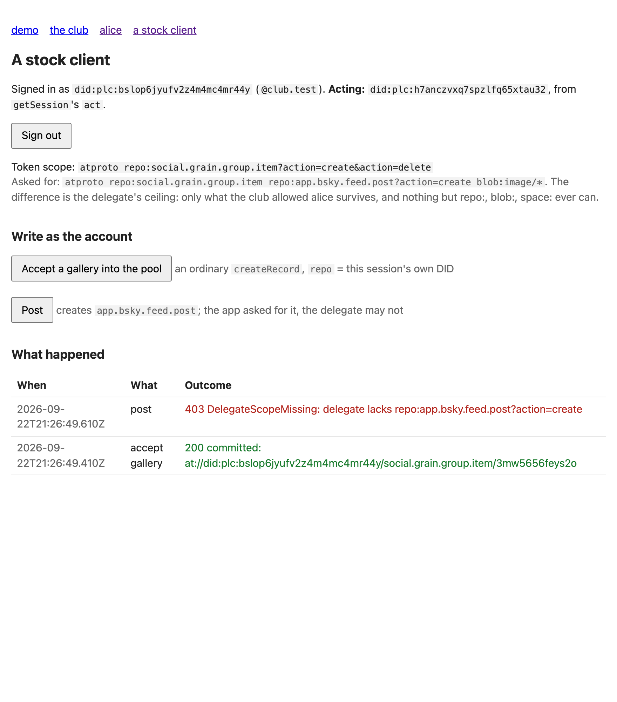 |
| Back on the club's PDS: the club's own consent screen, `club.test` signed in, the stock client's scopes as requested. | The stock client: signed in as the club, `act` = alice from `getSession`, the token scope narrowed to her permissions. Accept works, post is refused. |

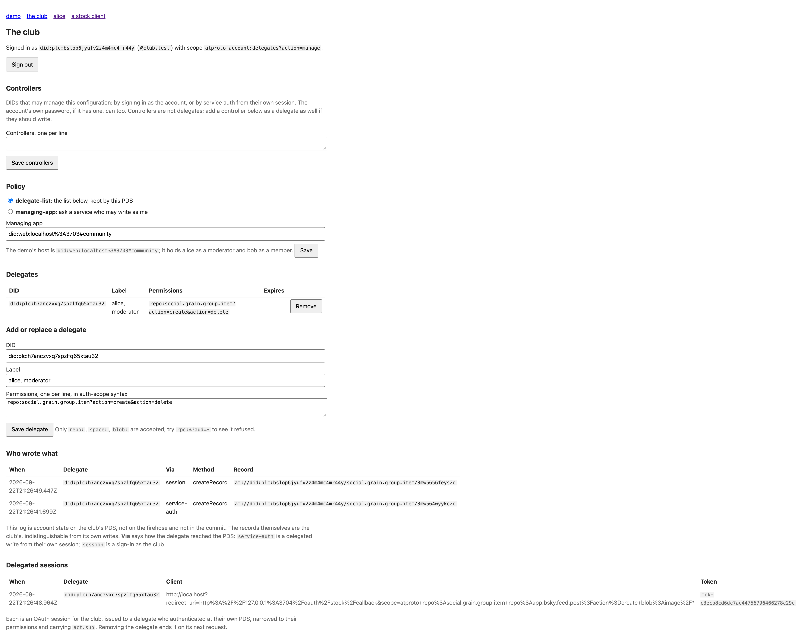

The club sees both paths in one log, with the path each took, and the delegated sessions that exist.

| | |
|---|---|
| 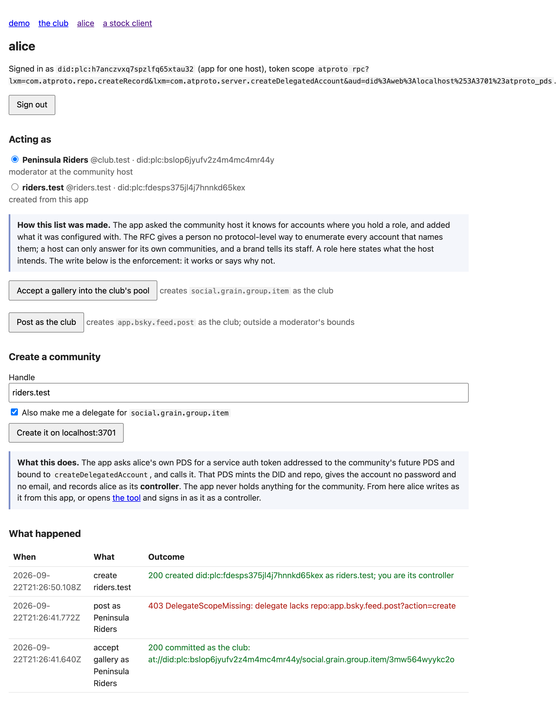 | 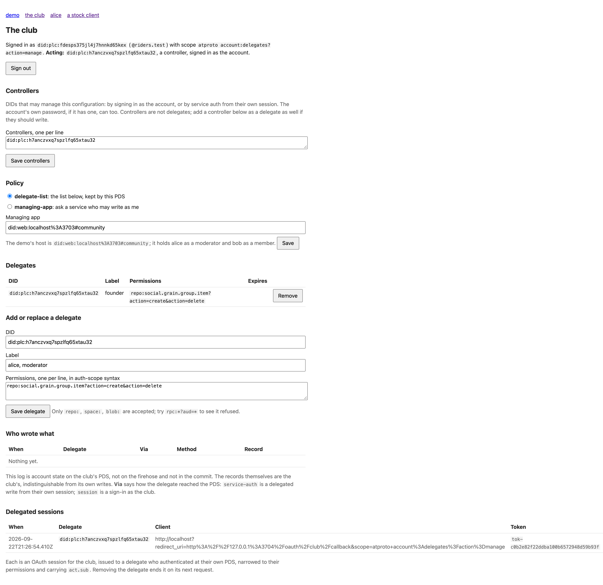 |
| alice creates `riders.test` from her own app. Her PDS issued the service auth; the community's PDS did the rest. She is its controller and, by her own choice, a delegate. | The tool, signed in as `riders.test` by alice as a controller. No password for riders exists. Her session kept `account:delegates`; a delegate who is not a controller gets `atproto` alone and the tool is refused. |

Nothing on alice's own consent screen names the club. What she consents to is that her app may write, as her, to accounts that name her; whether the club names her is the club's decision, on the club's PDS. In the sign-in-as path the roles reverse: the consent is the club's, on the club's PDS, and alice's PDS is asked for nothing but who she is. Discovery, how alice's app learns which accounts name her, is the proposal's open question, and the page takes its third option: after sign-in the app asks the community host it knows for accounts where alice holds a role, and adds what it was configured with, each entry saying where it came from.

Two ways to check it without clicking:

```sh
pnpm demo:app            # in one terminal
pnpm demo:walk           # in another: both flows and the creation flow, headless, 14 steps, checked
node scripts/screenshots.mjs   # or: the same in headless Chrome, producing docs/screenshots/
```

The walk signs in and consents through the provider UI's own endpoints and drives the app through its pages; it needs a fresh `pnpm demo:app`. The screenshot script needs Chrome (`CHROME=/path/to/chrome` to point at one).

The browser demo runs the two PDSes on different hostnames, `localhost` and `127.0.0.1`: browsers keep cookies per host, not per port, and both PDSes are authorization servers the browser signs in to during one flow.

## Installed-package patches

`pnpm install` runs `scripts/patch-account-delegates.mjs`, which edits three things in the installed OAuth packages, none of which change behaviour for what exists today. It adds `delegates` to the account attributes the scope parser accepts, and one card to the consent screen's account section, so `account:delegates` is not silently dropped from a request; and it adds one link to the stock sign-in form, "Sign in as a delegate of this account", pointing at the PDS's own sign-in-as page. The chunks it edits are served as immutable, so a browser that has seen the unpatched ones needs a hard refresh.

Two things the alpha's permission sets impose on the proposal's example, found by running it: an `include:` scope may name a specific service as `aud` but never `*`, so a set for general-purpose clients has to carry `aud=*` itself; and a set may only include methods under its own NSID authority, so the `com.atproto.space.*` methods need a sibling set. The RFC's example is corrected accordingly.

## What is in here

| Path | What it is |
|---|---|
| `src/delegates/router.ts` | The write path for both kinds of delegate (service auth, or a delegated session), the same bounding and log for each, `getSession` with `act`, the management methods with their three kinds of caller, and `createDelegatedAccount`. Each block names where it would live in the PDS. |
| `src/delegates/sign-in-as.ts` | Sign-in as the account: the nested login pages, and the provider integration that binds a request to a delegate, narrows the token, and puts `act.sub` on it. |
| `src/delegates/resolve.ts` | "Is this DID a delegate of that account, and how far": the delegate-list and managing-app policies, shared by both paths. |
| `src/delegates/scopes.ts` | The intersection of a requested scope with a delegate's permissions. |
| `src/delegates/store.ts` | The account's delegate configuration, the write log, and the bindings a delegated session needs, as host state in SQLite. |
| `src/pds.ts` | A stock alpha PDS embedded as a library with the two routers mounted in front. No package is modified beyond the patches above; requests the routers do not claim fall through. |
| `src/managing-app.ts` | What a community host becomes: roles, one `checkDelegate` answer, and a `listMemberships` query for the browser demo's discovery. It holds no keys and no credential for any account. |
| `src/demo.ts` | The transcript above. |
| `src/app.ts` | The browser demo's app: the club's settings tool, alice's app, and a stock client, server-rendered, signing in through OAuth with loopback clients. |
| `src/demo-app.ts` | Brings up the network for the browser demo, publishes the permission set on a local account, and waits. |
| `scripts/walk.mjs` | The browser flows, headless, as a check. |
| `scripts/screenshots.mjs` | The browser flows in headless Chrome, producing `docs/screenshots/`. |
| `scripts/patch-account-delegates.mjs` | The three edits to the installed OAuth packages. |
| `lexicons/` | Lexicon sketches for the new methods, and the `com.atproto.repo.delegatedWrites` permission set. |
| `docs/0017-account-delegates.md` | The proposal, copied here so the repo stands alone. |

## What it proves, and what it does not

**Proved, against unmodified published packages, for the delegated write:** a delegate writes to an account on another PDS with nothing but their own session; the write is committed and signed by the account's PDS as the account; a delegate entry expressed as `repo:` permission strings is enforced by the alpha's own `ScopePermissions` matcher; `applyWrites` is all-or-nothing; tokens are method-bound, sixty-second, and single-use; the account can list who wrote what; both policies work, with a `managing-app` consulted over real HTTP with a token the PDS signs as the account and the app verifies against the account's DID document. In the browser, the same write is made from an OAuth session gated by the `rpc:` permission the proposal describes, obtained through the stock consent screen, either audience-specific or through the permission set; and the management methods are gated by `account:delegates`.

**Proved for sign-in as the account:** a client that knows nothing about delegates gets a session for the account through the stock OAuth flow and the stock consent screen; the person authenticates at their own PDS, which is asked for `atproto` only and keeps no relationship with the account's PDS; the token's scope is the client's request intersected with the delegate's permissions, and nothing outside `repo:`, `blob:`, `space:` survives; the token and `getSession` carry `act.sub`; ordinary writes with it are bounded, committed as the account, and logged with the path; the device account created for the consent screen is removed once consent happens, and a leftover one cannot authorize another client; removing the delegate ends the session on its next request, and the client cannot refresh it. The delegate's own session at their PDS is never narrowed, never held.

**Proved for creation from an app:** a person on one PDS creates an account on another with nothing but their own session, the created account's DID resolves and its repo accepts delegated writes at once, the account has no password anyone knows and no reachable email, the creator is a controller and manages the account by service auth from their own session or by signing in as it, a delegate who is not a controller can do neither, and the creating app holds nothing for the account. The PDS's OAuth machinery requires an `account` row with an email and a password hash, so the account gets an unguessable password the PDS discards and an address under `.invalid`; the transcript checks that a password login is refused.

**Not built here, on purpose:**

- The delegate router is an extension mounted in front of the PDS, not a patch to it. The proposal's reference-implementation notes say where each piece goes; this is the same logic one process boundary out, so that a clone runs from npm. The sign-in-as integration uses the provider's public hooks and wraps two of its internals (token creation and the token store's read) for scope narrowing; inside the PDS those are two lines in the token manager.
- `pnpm demo` uses password sessions and `getServiceAuth`; the OAuth side is exercised by the browser demo and the walk only. Nothing in the delegated path depends on how the token was minted.
- The account's PDS acts as an OAuth client of the person's PDS through a loopback client id, so the person's consent screen says "an application on your device". A deployed PDS would publish its own client metadata under its hostname.
- A delegated session is an OAuth session, so it is for OAuth clients, and only `repo:`, `blob:`, and `space:` survive its narrowing. `transition:*` is dropped on purpose: it is a bridge clients are leaving, and giving it delegate semantics would mean inventing meaning for a scope meant to disappear. The Bluesky app signs in with passwords rather than OAuth today, so it is outside this path either way; for it, the only route to a shared account remains an app password on that account, which is what the proposal exists to replace. `space:` permissions survive narrowing only when the delegate holds them verbatim.
- Consent through a delegate is recorded by the stock provider as the account's consent for that client, so a later sign-in by the account's own controller to the same client skips the consent screen. A PDS adopting this would record delegate consent separately.
- `act` is on the access token and in `getSession`. It is not yet carried into inter-service tokens the PDS mints from a delegated session; `getServiceAuth` is outside a delegate's surface in this prototype.
- Operator policy on `createDelegatedAccount`: invites, allowlists, and rate limits apply as for `createAccount`, and the demo PDS requires none. A recovery key can be passed at creation and lands ahead of the PDS's rotation key, but nothing in the demo exercises PLC recovery.
- The account portal's own settings pages, space writes, `uploadBlob`, `getDelegationToken`, the `simplespace` management methods, and rate limiting by both account and delegate, as before.

## Why this shape

The usual way to let several people act as one account is to let them sign in *as* it: the account's authorization server authenticates the person, looks up their standing, and issues a narrowed session. Tranquil PDS does this today, and it has the property that matters most for adoption: every existing client works, because the client only sees an ordinary login. Its cost is that the policy lives inside the authorization server, so the account has to live on a PDS that implements it, and the person has a second session for every account they act for.

The delegated write, on its own, has the opposite profile: the account can live on any PDS that reads its delegate config, the person keeps one session, and there is no nested login; but every client has to learn to address a `repo` other than its own, and the consent at the person's PDS is about an open audience.

This prototype puts the policy on the account, where any PDS can read it and where a community host can answer for it, and offers both ways to exercise it. Sign-in-as needs no hooks and no knowledge of roles: the delegate configuration is exactly what those hooks were standing in for. The delegated write is there for apps that want one session and a "posting as" switch. Either way the account decides, the bounds are the same, the log is the same, and a delegate can never reach the account itself.
